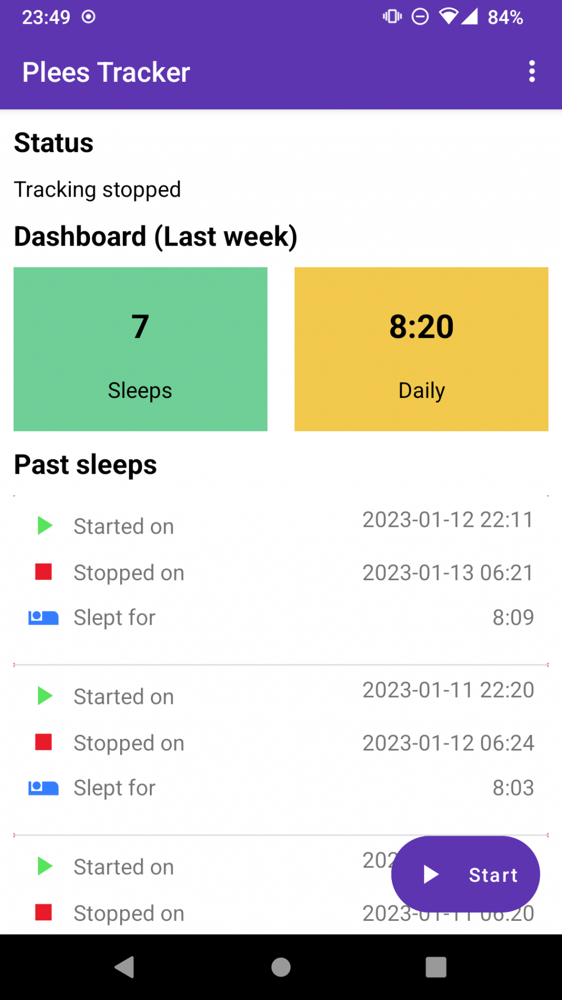

= plees-tracker

image:https://github.com/vmiklos/plees-tracker/workflows/tests/badge.svg["Build Status", link="https://github.com/vmiklos/plees-tracker/actions"]

Plees Tracker is a simple sleep tracker for your Android phone.

The latest version is v7.1.0, released on 2021-02-05.  See the
https://github.com/vmiklos/plees-tracker/blob/master/NEWS.adoc[release notes].

== Description

This is meant to be a very simple open source clone of
https://play.google.com/store/apps/details?id=com.primenap[PrimeNap], i.e. just track sleep
start/stop times and count the average / day.

Features:

- It literally does nothing while you sleep, causes no battery drain.

- Stores past sleeps, counts stat from them:

  * average of sleep durations

  * daily average: in case you sleep multiple times a day or you sometimes skip a whole day

- Exports/imports sleep data to/from CSV (the start and stop columns are UNIX timestamps in
  milliseconds).

- Can show past sleeps, can selectively delete individual sleeps.

It looks like this:

== Download

Get it on F-Droid:

image::doc/fdroid.png[width=194,height=75,link="https://f-droid.org/en/packages/hu.vmiklos.plees_tracker/"]

== License

Use of this source code is governed by a BSD-style license that can be found in
the LICENSE file.
