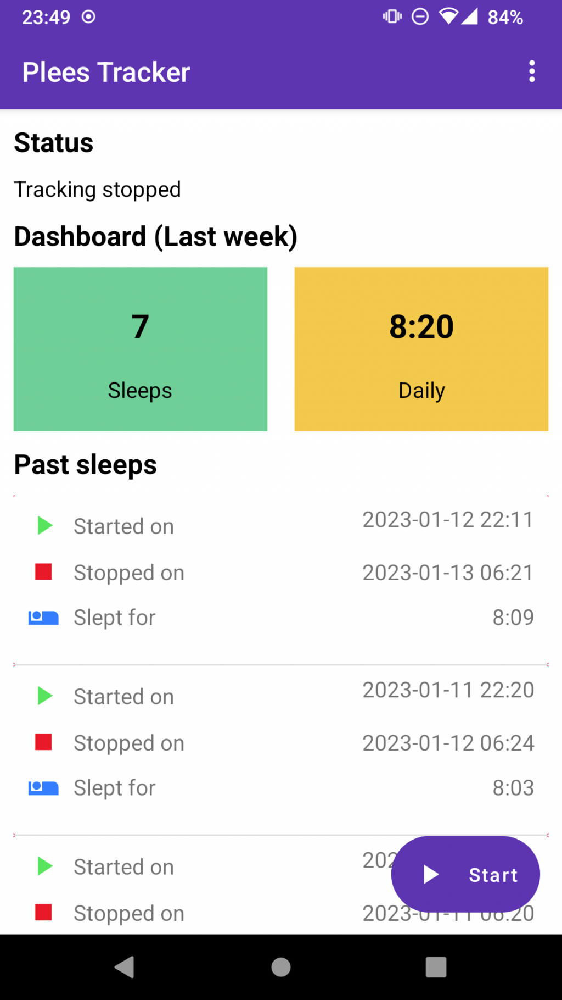

# plees-tracker

Plees Tracker is a simple sleep tracker for your Android phone.

This app is meant to be a simple open source sleep tracker, allowing you to track sleep start/stop times and count the average per day.

Features:
* It literally does nothing while you sleep, causes no battery drain.
* Stores past sleeps, counts stat from them.
* Exports/imports sleep data to/from CSV.
* Can show past sleeps, can selectively delete individual sleeps.

Check out the [user guide](https://vmiklos.hu/plees-tracker/) for a full list of features, 
installation, and usage information.

Get it on F-Droid:

image::doc/fdroid.png[width=194,height=75,link="https://f-droid.org/en/packages/hu.vmiklos.plees_tracker/"]

## Contributing
plees-tracker is free and open source. You can view the source code, file an issue, or request new features. 
If you'd like to contribute, please consider opening a pull request.

## License

Use of this source code is governed by a BSD-style license that can be found in the LICENSE file.
